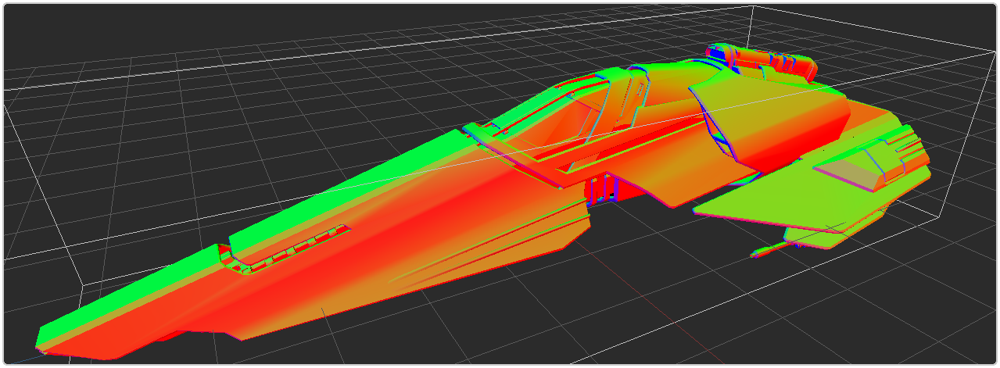
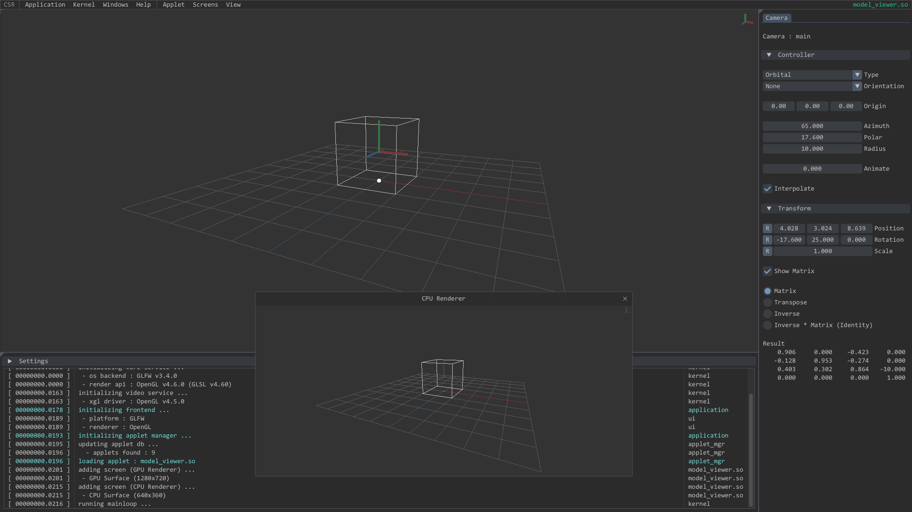
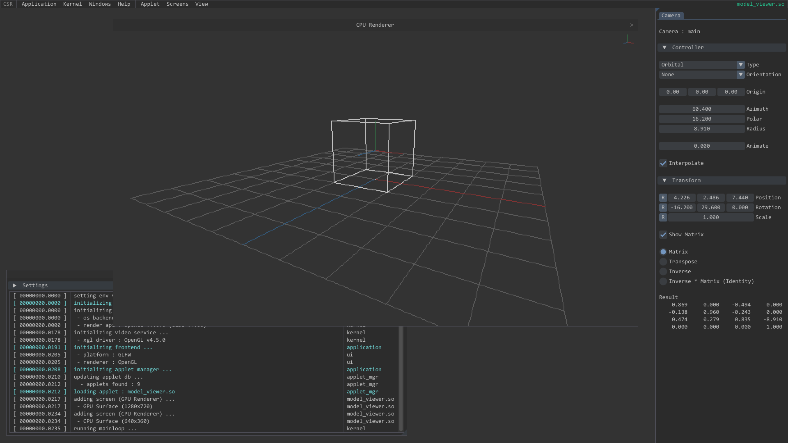
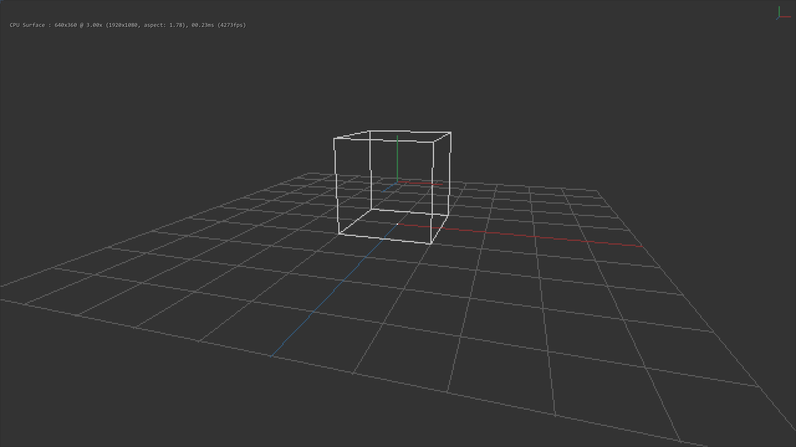
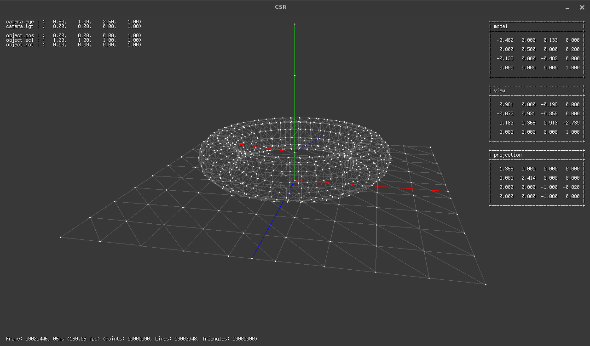

# CSR



## Overview

- [CSR](#csr)
  - [Overview](#overview)
  - [Introduction](#introduction)
  - [Build and Run](#build-and-run)
  - [Roadmap](#roadmap)
  - [Media](#media)

## Introduction

> *“It’s still magic even if you know how it’s done.”*
>
> *― Terry Pratchett*

This quote by Terry Pratchett is on point on how I feel about computer graphics. I always loved being immersed in nicely lit environments, feeling the dense atmosphere in unreal places or just wondering how all of this was actually made. Back then it was magic to me, just as it is today.

So welcome to my passion project on which I work(ed) in my freetime, which is also the playground for my CG related research.

## Build and Run

Linux only for now.

**External Dependencies**

* CMake
* GLFW
* Epoxy (OpenGL Glue)

<br/>

Modern features like DSA (Direct State Access) are used so at least OpenGL v4.5 is required.

**Checkout Repo and Submodules**

```shell
$ git clone https://github.com/papa-agoo/csr.git
$ cd csr/
$ git submodule update --init --recursive
```

<br/>

If you are swithing to a different branch or simply fetching new commits, you should always sync the internal dependencies (like ImGui) using `git submodule update`.

```shell
$ git checkout origin/develop -b develop
$ git submodule update --recursive
```

<br/>

**Generate Makefiles using CMake**

```shell
$ cmake -DCMAKE_BUILD_TYPE=Release -B build
```

<br/>

**Build and Install**

```shell
$ cd build/
$ sudo make all install
```

<br/>

**Run CSR**

Assuming `/opt/csr` is the install prefix (project root directory) set the `LD_LIBRARY_PATH` before executing CSR apps ...

```shell
$ export LD_LIBRARY_PATH=${LD_LIBRARY_PATH}:/opt/csr/lib
```

... or just add `/opt/csr/lib` to `ld.so.conf` once and forget about it.

<br/>

For now CSR apps must be run from within the `project root directory`.

```shell
$ cd /opt/csr
$ ./bin/csr_app
```

## Roadmap

The main focus lies on the Model Viewer Applet (model_viewer.so) which will be able to load and render (on GPU and on CPU) external models in Wavefront OBJ / glTF formats. Stuff like bug fixes, refactoring or smaller detours (which will happen :)) are not listed here.

<br/>

* **Milestone 1 (Prep Work)**
  - [x] Application
    - [x] Env Vars (support for something like {FOO}/{BAR}.baz at runtime)
    - [x] Per applet config ({APPLET_CONFIG_DIR}/my_applet.ini)
    - [x] App home dir ({USER_HOME_DIR}/.csr)
  - [x] Library
    - [x] Modern string impl. (immutable, length based)
    - [x] Arena memory allocator (bare bones)
    - [x] File I/O (OS level R/W API)

<br/>

* **Milestone 2 (Foundations)**
  - [x] Application
    - [x] Reload current applet
    - [x] Remember last loaded applet
  - [x] Library
    - [x] SoftGL #1
      - [x] Vertex Pipeline
      - [x] Fragment Pipeline
  - [x] Applets
    - [x] ecs_hello_world.so (some tests with Flecs)
    - [x] xgl_hello_cube.so (textured)
    - [x] model_viewer.so #1
      - [x] 3D scene (Base Grid, Orbit Camera, Orientantion Gizmo, Unit Cube AABB)
      - [x] User Interface (Model, Camera, Renderers, Debug Info)
      - [x] GPU + CPU renderers (XGL + SoftGL)

<br/>

* **Milestone 3 (Mesh Loading + Debug Materials)**
  - [ ] Application
    - [ ] User Help Window (Key Mappings for Application + Applet)
  - [ ] Library
    - [ ] SoftGL #2
      - [ ] Depth / Stencil States
      - [ ] Proper Culling
      - [ ] Proper Clipping
  - [ ] model_viewer.so #1
    - [ ] Builtin procedural meshes #1 (Cube, Sphere, Torus, ...)
    - [ ] Loaders for Wavefront OBJ / glTF files
    - [ ] Debug materials (Point Cloud, Wireframe, Normals, UVs, Solid)
    - [ ] Integration of the ImGuizmo Library
    - [ ] FPS Camera
    - [ ] Orthographic Rendering

<br/>

* **Milestone 4 (Lighting + Environment)**
  - [ ] Library
    - [ ] SoftGL #3
      - [ ] Proper Line Rasterizer (with attrib. interpolation)
      - [ ] Texture Mapping
      - [ ] OPTIMIZATION
  - [ ] model_viewer.so
    - [ ] Legacy Lighting
    - [ ] Soft Shadows
    - [ ] Environment (Sky, Fog, ...)

<br/>

* **Milestone X**
  - [ ] Rendering
    - [ ] PBR Pipeline
    - [ ] Post Processing
    - [ ] XGL SDF Text
  - ...

## Media

Release v0.0.5

GPU + CPU Renderers | CPU Renderer | CPU Renderer (fullscreen)
:-------------------------:|:-------------------------:|:-------------------------:
|  |  |  |

<br/>

Very early version. This little project ignited my passion for graphics programming a few years ago. :)


